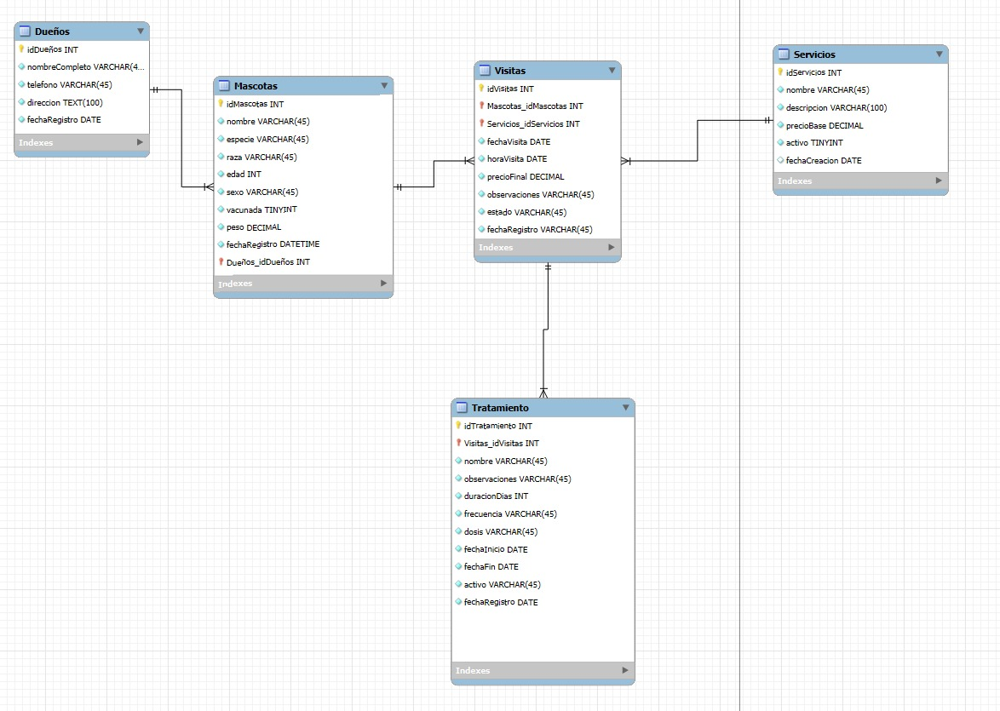

## # 🐾 Sistema de Gestión Veterinaria "Mi Mejor Amigo"

## 📋 Tabla de Contenidos
- [Introducción](#introducción)
- [Autores](#autores)
- [Entregables del Proyecto](#entregables-del-proyecto)
- [Diseño de la Base de Datos](#diseño-de-la-base-de-datos)
- [Estructura de Tablas](#estructura-de-tablas)
- [Proceso de Desarrollo](#proceso-de-desarrollo)
- [Instalación y Configuración](#instalación-y-configuración)
- [Consultas Implementadas](#consultas-implementadas)
- [Funciones SQL Demostradas](#funciones-sql-demostradas)
- [Diagrama UML E-R](#diagrama-uml-e-r)

## 🎯 Introducción

La veterinaria **"Mi Mejor Amigo"** es un centro de atención para mascotas que ofrece servicios médicos, de baño, estética y tratamientos. Recientemente, el personal administrativo ha tenido dificultades para llevar un registro eficiente de sus operaciones diarias, por lo que necesitan una base de datos que les permita organizar la información de manera estructurada y accesible.

Este proyecto presenta una **solución completa de base de datos** desarrollada en MySQL que resuelve las necesidades específicas de la veterinaria, implementando un sistema robusto para la gestión integral de:

### 📋 Requerimientos Funcionales Implementados
- 🧑‍⚕️ **Dueños de Mascotas**: Registro completo con cédula, nombre, teléfono y dirección
- 🐶 **Mascotas**: Control detallado incluyendo especie, raza, edad, sexo y estado de vacunación
- 🧼 **Servicios**: Catálogo completo con descripción y precios base (baño, consultas, vacunación, etc.)
- 📅 **Visitas**: Historial completo de cada atención médica y servicio prestado
- 💊 **Tratamientos**: Seguimiento de medicamentos y terapias prescritas por visita

### Objetivos del Proyecto
- ✅ Resolver la problemática de registro manual e ineficiente
- ✅ Centralizar toda la información operativa de la veterinaria
- ✅ Facilitar el acceso al historial médico de cada mascota
- ✅ Automatizar cálculos y generar reportes estadísticos
- ✅ Optimizar el tiempo de consulta de información
- ✅ Garantizar la integridad y consistencia de los datos

## 👥 Autores

| Nombre |  | GitHub | Rol |
|--------|-------------------|-------|-----|
| [Dyaln Acevedo] | | tu.email@estudiante.edu.co | Desarrollador |
| [Jeferson Lopez] | | email@estudiante.edu.co | Desarrollador |


## 🧾 Entregables del Proyecto


## 1.  Diseño de la Base de Datos

### Modelo Entidad-Relación

El sistema está compuesto por **5 entidades principales** que modelan la realidad del negocio veterinario, siguiendo un diseño normalizado que garantiza la integridad y eficiencia de los datos.

#### 📊 Entidades y Atributos

| Entidad | Llave Primaria | Atributos Principales | Llaves Foráneas |
|---------|---------------|----------------------|-----------------|
| **Dueños** | idDuenos (INT) | nombreCompleto, telefono, direccion, fechaRegistro | - |
| **Mascotas** | idMascotas (INT) | nombre, especie, raza, edad, sexo, vacunada, peso, fechaRegistro | Duenos_idDuenos |
| **Servicios** | idServicios (INT) | nombre, descripcion, precioBase, activo, fechaCreacion | - |
| **Visitas** | idVisitas (INT) | fechaVisita, horaVisita, precioFinal, observaciones, estado, fechaRegistro | Mascotas_idMascotas, Servicios_idServicios |
| **Tratamientos** | idTratamiento (INT) | nombre, observaciones, duracionDias, frecuencia, dosis, fechaInicio, fechaFin, activo, fechaRegistro | Visitas_idVisitas |

**Características del Diagrama:**
- ✅ Contiene las 5 entidades requeridas: Dueño, Mascota, Servicio, Visita, Tratamiento
- ✅ Especifica todas las relaciones y cardinalidades
- ✅ Identifica llaves primarias (PK) y foráneas (FK)
- ✅ Muestra atributos de cada entidad

### 2. 🏗️ Archivo DDL (`estructura.sql`)
**Contenido:**
- Instrucciones `CREATE DATABASE` y `USE`
- Definición de las 5 tablas principales con `CREATE TABLE`
- Implementación de llaves primarias y foráneas
- Restricciones de integridad y validación
- Índices para optimización de consultas
- Vistas útiles para consultas frecuentes

### 3. 📊 Archivo DML (`datos.sql`)
**Datos de Prueba Incluidos:**
- ✅ 5 dueños con información completa
- ✅ 10 mascotas de diferentes especies y características
- ✅ 5 servicios veterinarios (baño, consulta, vacunación, etc.)
- ✅ 15 visitas distribuidas entre las mascotas
- ✅ 7 tratamientos asociados a diferentes visitas

### 4. 🔍 Archivo DQL (`consultas.sql`)
**20+ Consultas que demuestran:**
- Creación de tabla desde consulta
- Uso de alias en campos y subconsultas
- Funciones de agregación (COUNT, AVG, MAX, MIN, SUM)
- Funciones de cadena (CONCAT, UPPER, LOWER)
- Funciones de manipulación (LENGTH, SUBSTRING, TRIM)
- Función matemática (ROUND)
- Condicionales (IF en campos)
- JOINs complejos, GROUP BY, HAVING, ORDER BY

## 📊 Estructura de Tablas

### 🏠 Tabla: DUEÑOS
```sql
CREATE TABLE duenos (
    cedula VARCHAR(20) PRIMARY KEY,
    nombre_completo VARCHAR(100) NOT NULL,
    telefono VARCHAR(15) NOT NULL,
    direccion TEXT NOT NULL,
    fecha_registro TIMESTAMP DEFAULT CURRENT_TIMESTAMP
);
```
**Propósito**: Almacena la información personal de los propietarios de mascotas.

### 🐕 Tabla: MASCOTAS
```sql
CREATE TABLE mascotas (
    id_mascota INT AUTO_INCREMENT PRIMARY KEY,
    nombre VARCHAR(50) NOT NULL,
    especie ENUM('Perro', 'Gato', 'Ave', 'Conejo', 'Hamster', 'Reptil', 'Otro'),
    raza VARCHAR(50) NOT NULL,
    edad INT CHECK (edad >= 0 AND edad <= 30),
    sexo ENUM('Macho', 'Hembra') NOT NULL,
    vacunada BOOLEAN DEFAULT FALSE,
    cedula_dueno VARCHAR(20) NOT NULL,
    peso DECIMAL(5,2) DEFAULT NULL,
    FOREIGN KEY (cedula_dueno) REFERENCES duenos(cedula)
);
```
**Propósito**: Registra toda la información relevante de las mascotas pacientes.

### 🏥 Tabla: SERVICIOS
```sql
CREATE TABLE servicios (
    id_servicio INT AUTO_INCREMENT PRIMARY KEY,
    nombre VARCHAR(50) NOT NULL UNIQUE,
    descripcion TEXT NOT NULL,
    precio_base DECIMAL(10,2) NOT NULL CHECK (precio_base > 0),
    activo BOOLEAN DEFAULT TRUE
);
```
**Propósito**: Catálogo de servicios veterinarios disponibles con sus precios.

### 📅 Tabla: VISITAS
```sql
CREATE TABLE visitas (
    id_visita INT AUTO_INCREMENT PRIMARY KEY,
    id_mascota INT NOT NULL,
    id_servicio INT NOT NULL,
    fecha_visita DATE NOT NULL,
    hora_visita TIME DEFAULT NULL,
    precio_final DECIMAL(10,2) DEFAULT NULL,
    observaciones TEXT DEFAULT NULL,
    estado ENUM('Completada', 'Pendiente', 'Cancelada'),
    FOREIGN KEY (id_mascota) REFERENCES mascotas(id_mascota),
    FOREIGN KEY (id_servicio) REFERENCES servicios(id_servicio)
);
```
**Propósito**: Registro detallado de todas las citas y consultas veterinarias.

### 💊 Tabla: TRATAMIENTOS
```sql
CREATE TABLE tratamientos (
    id_tratamiento INT AUTO_INCREMENT PRIMARY KEY,
    nombre VARCHAR(100) NOT NULL,
    observaciones TEXT NOT NULL,
    id_visita INT NOT NULL,
    duracion_dias INT CHECK (duracion_dias > 0),
    frecuencia VARCHAR(50) DEFAULT NULL,
    dosis VARCHAR(100) DEFAULT NULL,
    fecha_inicio DATE DEFAULT NULL,
    fecha_fin DATE DEFAULT NULL,
    activo BOOLEAN DEFAULT TRUE,
    FOREIGN KEY (id_visita) REFERENCES visitas(id_visita)
);
```
**Propósito**: Seguimiento de medicamentos y tratamientos prescritos.

## ⚙️ Proceso de Desarrollo

### Fase 1: Análisis y Diseño
1. **Identificación de Requerimientos**
   - Análisis de necesidades de una clínica veterinaria
   - Definición de entidades y relaciones
   - Establecimiento de reglas de negocio

2. **Diseño Conceptual**
   - Creación del modelo Entidad-Relación
   - Definición de atributos y tipos de datos
   - Establecimiento de llaves primarias y foráneas

### Fase 2: Implementación
1. **Creación de Estructura (DDL)**
   - Definición de tablas con restricciones
   - Implementación de índices para optimización
   - Creación de vistas para consultas frecuentes
   - Desarrollo de procedimientos almacenados

2. **Carga de Datos (DML)**
   - Inserción de datos de prueba realistas
   - Validación de integridad referencial
   - Verificación de restricciones de dominio

### Fase 3: Consultas y Análisis (DQL)
1. **Desarrollo de Consultas Básicas**
   - Selecciones simples con filtros
   - Uso de funciones de agregación
   - Implementación de alias y formato

2. **Consultas Avanzadas**
   - Subconsultas correlacionadas
   - Funciones de ventana (RANK, OVER)
   - Análisis temporal y estadístico

## 🚀 Instalación y Configuración

### Prerrequisitos
- MySQL Server 8.0 o superior
- MySQL Workbench (recomendado)
- Privilegios de administrador de base de datos

### Pasos de Instalación
1. **Clonar o descargar el proyecto**
   ```bash
   git clone [github.com/Deamacevedo/Taller-veterinaria-base-de-datos]
   ```

2. **Ejecutar scripts en orden**
   ```sql
   -- 1. Crear estructura
   SOURCE estructura.sql;
   
   -- 2. Insertar datos de prueba
   SOURCE datos.sql;
   
   -- 3. Ejecutar consultas de ejemplo
   SOURCE consultas.sql;
   ```

3. **Verificar instalación**
   ```sql
   USE veterinaria_mi_mejor_amigo;
   SHOW TABLES;
   SELECT COUNT(*) FROM mascotas;
   ```

## 💻 Consultas Implementadas

El archivo `consultas.sql` contiene **más de 20 consultas** que cumplen con todos los requerimientos especificados:

### 📊 Consultas Básicas Requeridas

#### 1. Creación de Tabla desde Consulta
```sql
-- Crear tabla con mascotas vacunadas y sus dueños
CREATE TABLE IF NOT EXISTS mascotas_vacunadas_reporte AS
SELECT 
    m.id_mascota,
    m.nombre AS nombre_mascota,
    m.especie,
    d.nombre_completo AS propietario
FROM mascotas m
INNER JOIN duenos d ON m.cedula_dueno = d.cedula
WHERE m.vacunada = TRUE;
```

#### 2. Alias en Campos
```sql
SELECT 
    nombre AS 'Nombre de la Mascota',
    especie AS 'Tipo de Animal',
    raza AS 'Raza Específica',
    edad AS 'Años de Edad'
FROM mascotas;
```

#### 3. Alias en Subconsultas
```sql
SELECT 
    prop.nombre_completo AS 'Propietario',
    prop.total_mascotas AS 'Cantidad de Mascotas'
FROM (
    SELECT d.nombre_completo, COUNT(m.id_mascota) AS total_mascotas
    FROM duenos d
    LEFT JOIN mascotas m ON d.cedula = m.cedula_dueno
    GROUP BY d.cedula
) AS prop;
```

### 🔢 Funciones de Agregación

#### COUNT, AVG, MAX, MIN
```sql
SELECT 
    especie AS 'Especie',
    COUNT(*) AS 'Total de Animales',
    ROUND(AVG(edad), 2) AS 'Edad Promedio',
    MAX(edad) AS 'Edad Máxima',
    MIN(edad) AS 'Edad Mínima'
FROM mascotas
GROUP BY especie;
```

### 🔤 Funciones de Cadena

#### CONCAT
```sql
SELECT 
    CONCAT(m.nombre, ' (', m.especie, ')') AS 'Mascota y Especie',
    CONCAT(d.nombre_completo, ' - Tel: ', d.telefono) AS 'Información del Dueño'
FROM mascotas m
INNER JOIN duenos d ON m.cedula_dueno = d.cedula;
```

#### UPPER y LOWER
```sql
SELECT 
    UPPER(nombre) AS 'NOMBRE_MAYUSCULA',
    LOWER(raza) AS 'raza_minuscula'
FROM mascotas;
```

#### LENGTH, SUBSTRING, TRIM
```sql
SELECT 
    nombre AS 'Nombre Original',
    LENGTH(nombre) AS 'Longitud_Nombre',
    SUBSTRING(nombre, 1, 3) AS 'Primeras_3_Letras',
    TRIM(CONCAT('  ', nombre, '  ')) AS 'Nombre_Sin_Espacios'
FROM mascotas;
```

### 🔢 Funciones Matemáticas y Condicionales

#### ROUND
```sql
SELECT 
    nombre AS 'Mascota',
    peso AS 'Peso_Original',
    ROUND(peso, 0) AS 'Peso_Redondeado',
    ROUND(peso * 2.20462, 2) AS 'Peso_en_Libras'
FROM mascotas
WHERE peso IS NOT NULL;
```

#### IF en Campos
```sql
SELECT 
    nombre AS 'Mascota',
    IF(edad <= 1, 'Cachorro/Cría', 
       IF(edad <= 6, 'Adulto Joven', 'Adulto Mayor')) AS 'Clasificación_Edad',
    IF(vacunada = TRUE, 'Al día', 'Requiere vacunación') AS 'Estado_Vacunas'
FROM mascotas;
```

### 🔗 Consultas Avanzadas Adicionales

- **JOINs Complejos**: Múltiples tablas relacionadas
- **GROUP BY con HAVING**: Filtros sobre grupos
- **Subconsultas Correlacionadas**: Consultas dependientes
- **Análisis Temporal**: Funciones de fecha
- **Window Functions**: RANK() y OVER()
- **Reportes Estadísticos**: Análisis de popularidad y ingresos

## 🔍 Consultas Destacadas

### 1. Mascotas sin Visitas Recientes
```sql
SELECT 
    m.nombre AS 'Mascota',
    d.nombre_completo AS 'Propietario',
    d.telefono,
    IFNULL(DATEDIFF(CURDATE(), MAX(v.fecha_visita)), 999) AS 'Dias_Sin_Visita'
FROM mascotas m
INNER JOIN duenos d ON m.cedula_dueno = d.cedula
LEFT JOIN visitas v ON m.id_mascota = v.id_mascota
GROUP BY m.id_mascota
HAVING MAX(v.fecha_visita) IS NULL 
   OR DATEDIFF(CURDATE(), MAX(v.fecha_visita)) > 30;
```

### 2. Ranking de Servicios Más Populares
```sql
SELECT 
    RANK() OVER (ORDER BY COUNT(v.id_visita) DESC) AS 'Ranking',
    s.nombre AS 'Servicio',
    COUNT(v.id_visita) AS 'Veces_Solicitado',
    SUM(v.precio_final) AS 'Ingresos_Generados'
FROM servicios s
LEFT JOIN visitas v ON s.id_servicio = v.id_servicio
GROUP BY s.id_servicio, s.nombre
ORDER BY COUNT(v.id_visita) DESC;
```

### 3. Análisis Financiero por Cliente
```sql
SELECT 
    d.nombre_completo AS 'Cliente',
    COUNT(DISTINCT m.id_mascota) AS 'Mascotas_Registradas',
    SUM(v.precio_final) AS 'Gasto_Total_Historico',
    CASE 
        WHEN SUM(v.precio_final) > 100000 THEN 'Cliente Premium'
        WHEN SUM(v.precio_final) > 50000 THEN 'Cliente Frecuente'
        ELSE 'Cliente Regular'
    END AS 'Categoria_Cliente'
FROM duenos d
INNER JOIN mascotas m ON d.cedula = m.cedula_dueno
INNER JOIN visitas v ON m.id_mascota = v.id_mascota
GROUP BY d.cedula, d.nombre_completo
ORDER BY SUM(v.precio_final) DESC;
```

## 🛠️ Funciones SQL Demostradas

### ✅ Requerimientos Cumplidos (Mínimo 15 consultas)

| Función SQL | Implementada | Ejemplo de Uso |
|-------------|:------------:|----------------|
| **Creación de tabla desde consulta** | ✅ | `CREATE TABLE ... AS SELECT` |
| **Alias en campos** | ✅ | `nombre AS 'Nombre de la Mascota'` |
| **Alias en subconsultas** | ✅ | `FROM (...) AS prop` |
| **COUNT** | ✅ | Conteo de mascotas por especie |
| **AVG** | ✅ | Promedio de edad y peso |
| **MAX/MIN** | ✅ | Edades y pesos extremos |
| **SUM** | ✅ | Total de ingresos por servicio |
| **Alias en agregaciones** | ✅ | `COUNT(*) AS 'Total_Animales'` |
| **CONCAT** | ✅ | Unión de nombre y especie |
| **UPPER** | ✅ | Nombres en mayúsculas |
| **LOWER** | ✅ | Razas en minúsculas |
| **LENGTH** | ✅ | Longitud de nombres |
| **SUBSTRING** | ✅ | Primeras letras de nombres |
| **TRIM** | ✅ | Eliminación de espacios |
| **ROUND** | ✅ | Redondeo de pesos y precios |
| **IF en campos** | ✅ | Clasificación por edad |

### 🔄 Funciones Adicionales Implementadas

- **JOIN (INNER, LEFT)**: Relaciones entre tablas
- **GROUP BY**: Agrupación de datos
- **HAVING**: Filtros sobre grupos
- **ORDER BY**: Ordenamiento de resultados
- **CASE WHEN**: Condicionales complejas
- **IFNULL**: Manejo de valores nulos
- **Subconsultas correlacionadas**: Consultas dependientes
- **Window Functions**: RANK(), OVER(), PARTITION BY
- **Funciones de fecha**: YEAR(), MONTH(), DATEDIFF()
- **GROUP_CONCAT**: Concatenación de grupos

## 📈 Diagrama UML E-R


### Especificaciones del Diagrama




### Cardinalidades Implementadas
- **Dueño ─(1:N)─ Mascota**: Un dueño puede tener varias mascotas
- **Mascota ─(1:N)─ Visita**: Una mascota puede tener múltiples visitas
- **Servicio ─(1:N)─ Visita**: Un servicio puede aplicarse en múltiples visitas
- **Visita ─(1:N)─ Tratamiento**: Una visita puede generar varios tratamientos

### Restricciones Implementadas
- **Llaves Primarias**: Identificadores únicos en cada tabla
- **Llaves Foráneas**: Integridad referencial entre tablas
- **CHECK**: Validaciones de edad (0-30 años) y precios positivos
- **ENUM**: Valores controlados para especie, sexo y estado
- **NOT NULL**: Campos obligatorios según requerimientos

---

## 📝 Notas del Proyecto

### 🎯 Cumplimiento de Requerimientos
- ✅ **5 Entidades implementadas**: Dueños, Mascotas, Servicios, Visitas, Tratamientos
- ✅ **Cardinalidades correctas**: Todas las relaciones 1:N implementadas según especificación
- ✅ **Datos mínimos**: 5 dueños, 10 mascotas, 5 servicios, 15 visitas, 7 tratamientos
- ✅ **20+ Consultas**: Todas las funciones SQL requeridas implementadas
- ✅ **Restricciones**: Llaves primarias, foráneas y validaciones de dominio

### 🔧 Características Técnicas
- **Normalización**: Base de datos en 3FN
- **Integridad Referencial**: Cascada en eliminaciones, restricción en actualizaciones
- **Optimización**: Índices estratégicos para mejorar rendimiento
- **Flexibilidad**: Campos opcionales para peso, observaciones y tratamientos
- **Escalabilidad**: Estructura preparada para crecimiento futuro

### 📁 Estructura de Archivos
```
veterinaria-mi-mejor-amigo/
├── README.md
├── estructura.sql          # DDL - Definición de tablas
├── datos.sql              # DML - Datos de prueba  
├── consultas.sql          # DQL - 20+ consultas
└── assets/
    └── diagrama_uml_er.png
```
---
*Proyecto desarrollado como solución integral para la gestión de la Veterinaria "Mi Mejor Amigo" 🐾*

### Link de video

https://drive.google.com/file/d/1e5oqaFhXdc-mYSY_Etrk6WqomGOW1Z6X/view?usp=sharing